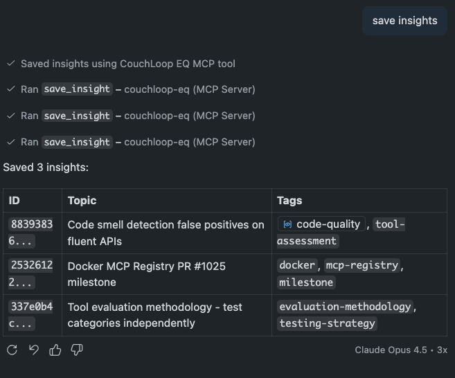
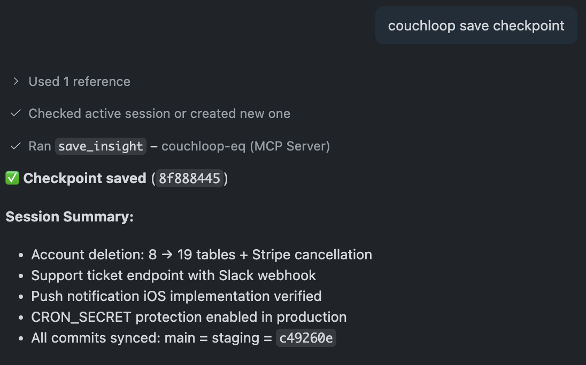
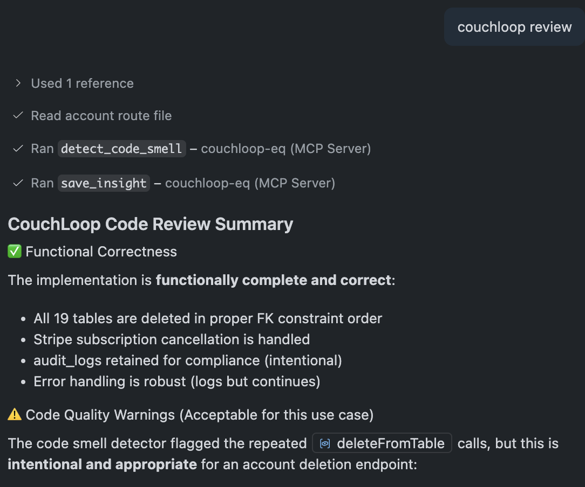

# CouchLoop EQ — MCP Server

Behavioral governance layer for safer, more consistent AI conversations.

<p align="center">
  
</p>

<p align="center">
  <a href="https://www.npmjs.com/package/couchloop-eq-mcp"></a>
  <a href="LICENSE"></a>
  <a href="https://github.com/wisenbergg/couchloop-mcp"></a>
</p>

<p align="center">
  <a href="https://mcp.couchloop.com">🌐 Landing Page</a> •
  <a href="https://www.npmjs.com/package/couchloop-eq-mcp">📦 npm</a> •
  <a href="https://github.com/wisenbergg/couchloop-mcp">⭐ GitHub</a>
</p>

## What is CouchLoop EQ?

CouchLoop EQ is an MCP (Model Context Protocol) server that provides behavioral governance for LLMs. It monitors AI responses for hallucination, inconsistency, tone drift, and unsafe reasoning patterns—while also managing stateful sessions and guided journeys that remember where you left off.

## Why CouchLoop EQ?

Unlike raw LLMs that can hallucinate packages, generate insecure code, and lose context mid-conversation, CouchLoop EQ catches problems before they ship:

| Problem | CouchLoop EQ Solution |
|---------|----------------------|
| 🎭 **Hallucinated packages** | `validate_packages` catches fake npm/PyPI/Maven before install |
| 🔓 **Insecure code** | `scan_security` detects SQLi, XSS, hardcoded secrets |
| 📉 **Code bloat** | `detect_code_smell` flags over-engineering and verbose patterns |
| 🧠 **Lost context** | `preserve_context` stores architecture decisions across sessions |
| 🗂️ **Accidental deletion** | `protect_files` + `rollback_file` with automatic backups |
| 📚 **Deprecated APIs** | `validate_library_versions` warns about outdated patterns |
| 🔍 **Sloppy AI code** | `pre_review_code` catches console.logs, TODOs, missing error handling |

## Key Safety Features

### Behavioral Governance
- **Hallucination Detection**: Monitors for fabricated facts and unsupported claims
- **Consistency Checking**: Identifies contradictions and logical incoherence across turns
- **Tone Monitoring**: Detects emotional escalation, manipulation, or dependency-forming language
- **Safety Guardrails**: Prevents harmful advice, clinical overreach, and inappropriate moralizing

### Session Management
- **Stateful Conversations**: Maintains context across multiple interactions
- **Progress Tracking**: Remember where users left off in guided journeys
- **Crisis Detection**: Integration with therapeutic AI for emotional support
- **Memory Context**: Preserves important insights and checkpoints

## Quick Start

CouchLoop EQ is a standard MCP server that works with **any MCP-compatible client**—Claude Desktop, ChatGPT, Cursor, Windsurf, VS Code, and more.

### Option 1: Connect to Hosted Server (Easiest)

**Production endpoint:** `https://mcp.couchloop.com/mcp`

For Claude Desktop (v0.7.0+), add to `~/Library/Application Support/Claude/claude_desktop_config.json`:

```json
{
  "mcpServers": {
    "couchloop-eq": {
      "url": "https://mcp.couchloop.com/mcp",
      "transport": "streamable-http"
    }
  }
}
```

Restart Claude and try: **"Start a daily reflection session"**

### Option 2: Run Locally (v1.1.2)

```bash
npm install -g couchloop-eq-mcp
```

Add to Claude Desktop configuration:

```json
{
  "mcpServers": {
    "couchloop-eq": {
      "command": "couchloop-eq-mcp",
      "env": {
        "COUCHLOOP_SERVER": "https://mcp.couchloop.com"
      }
    }
  }
}
```

**New in v1.0.4**: Sessions automatically persist locally to `~/.couchloop-mcp/identity.json` - no signup required!

### For ChatGPT (Developer Mode)

ChatGPT supports MCP servers through Developer Mode. See [CHATGPT_SETUP.md](CHATGPT_SETUP.md) for detailed setup instructions.

### For Other MCP Clients

Any MCP-compatible client (Cursor, Windsurf, Continue, etc.) can connect using:
- **URL:** `https://mcp.couchloop.com/mcp`
- **Transport:** `streamable-http`
- **Auth:** None required (session-based isolation)

**Production Server Available:** `https://mcp.couchloop.com/mcp`

Quick steps:
1. Enable Developer Mode in ChatGPT Settings
2. Add as MCP connector with URL: `https://mcp.couchloop.com/mcp`
3. No authentication required - uses session-based isolation

For local development:
- Use ngrok or deploy your own server
- Follow setup in [CHATGPT_SETUP.md](CHATGPT_SETUP.md)

## Available Tools (23 total)

### Session & Journey
| Tool | Description |
|------|-------------|
| `create_session` | Start a new guided session, optionally with a journey |
| `resume_session` | Resume a previously paused session |
| `send_message` | Send a message through the therapeutic AI stack |
| `save_checkpoint` | Save progress or capture a key moment |
| `get_checkpoints` | Retrieve all checkpoints for a session |
| `list_journeys` | List available guided journeys |
| `get_journey_status` | Get current progress in a session/journey |
| `save_insight` | Capture a meaningful insight from the conversation |
| `get_insights` | Retrieve saved insights |
| `get_user_context` | Get relevant context for personalization |

### Developer Safety
| Tool | Description |
|------|-------------|
| `validate_packages` | Catch hallucinated npm/PyPI/Maven packages before install |
| `validate_library_versions` | Check for deprecated APIs and outdated patterns |
| `scan_security` | Detect SQL injection, XSS, hardcoded secrets |
| `pre_review_code` | Screen AI code for console.logs, TODOs, missing error handling |
| `detect_code_smell` | Find verbose, over-engineered, or bloated code |

### Context & File Protection
| Tool | Description |
|------|-------------|
| `preserve_context` | Store architecture decisions across conversations |
| `get_operation_history` | Review file operations that were attempted |
| `enable_code_freeze` | Protect critical files from modification |
| `disable_code_freeze` | Re-enable file modifications |
| `protect_files` | Validate operations against protected paths |
| `rollback_file` | Restore files from backup snapshots |
| `get_protection_status` | View current file protection config |
| `list_backups` | See available backup snapshots |

## Available Journeys

- **Daily Reflection** (5 min) — A brief check-in to process your day
- **Gratitude Practice** (3 min) — Notice and name three things you appreciate
- **Weekly Review** (10 min) — Look back on your week and set intentions

## Example Usage

Start a daily reflection:
```
"Start a daily reflection session"
```

Resume where you left off:
```
"Resume my last session"
```

Save an insight:
```
"Save this insight: I notice I'm more energized in the mornings"
```

## Screenshots

<p align="center">
  
  
  
</p>

## Support

- Issues: [github.com/wisenbergg/couchloop-mcp/issues](https://github.com/wisenbergg/couchloop-mcp/issues)
- Email: support@couchloop.com

## License

MIT
