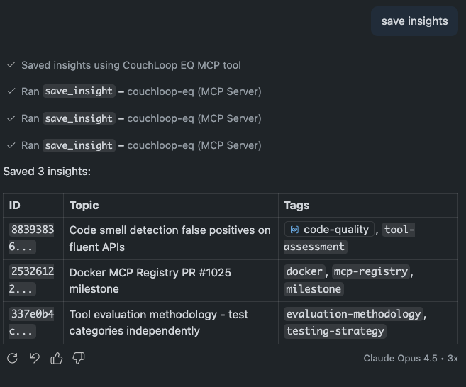
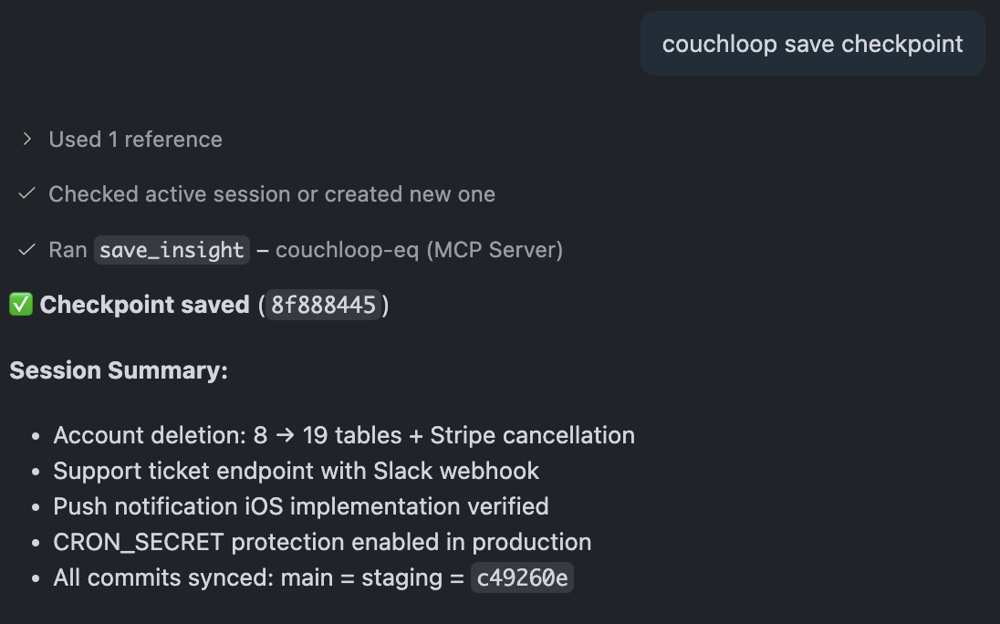
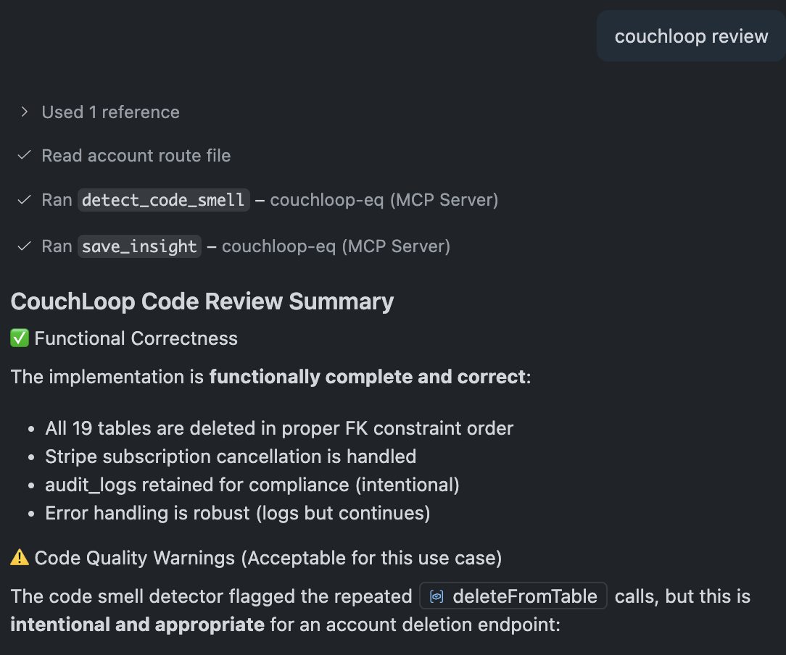

# CouchLoop EQ — MCP Server

Behavioral governance layer for safer, more consistent AI conversations.

<p align="center">
  
</p>

<p align="center">
  <a href="https://www.npmjs.com/package/couchloop-eq-mcp"></a>
  <a href="LICENSE"></a>
  <a href="https://github.com/wisenbergg/couchloop-mcp"></a>
</p>

<p align="center">
  <a href="https://mcp.couchloop.com">🌐 Landing Page</a> •
  <a href="https://www.npmjs.com/package/couchloop-eq-mcp">📦 npm</a> •
  <a href="https://github.com/wisenbergg/couchloop-mcp">⭐ GitHub</a>
</p>

---

## 📖 Choose Your Guide

| Use Case          | Guide                                      | Description                                                              |
| ----------------- | ------------------------------------------ | ------------------------------------------------------------------------ |
| 💻 **Developers** | [README-DEVELOPER.md](README-DEVELOPER.md) | Package validation, security scanning, code review, context preservation |
| 🧘 **Wellness**   | [README-WELLNESS.md](README-WELLNESS.md)   | Guided sessions, journeys, insights, reflection tools                    |

---

## What is CouchLoop EQ?

CouchLoop EQ v2.0 is a **high-performance, modular orchestration system** for AI behavioral governance. Built on MCP (Model Context Protocol), it provides confidence-based routing, parallel execution, and comprehensive observability—while monitoring for hallucination, inconsistency, and unsafe reasoning patterns.

## Why CouchLoop EQ?

Unlike raw LLMs that can hallucinate packages, generate insecure code, and lose context mid-conversation, CouchLoop EQ catches problems before they ship:

| Problem                      | CouchLoop EQ Solution                                                         |
| ---------------------------- | ----------------------------------------------------------------------------- |
| 🎭 **Hallucinated packages** | `verify` + `package_audit` catch fake npm/PyPI/Maven before install           |
| 🔓 **Insecure code**         | `code_review` detects SQLi, XSS, hardcoded secrets                            |
| 📉 **Code bloat**            | `code_review` flags over-engineering, console.logs, missing error handling    |
| 🧠 **Lost context**          | `remember` stores architecture decisions and checkpoints across sessions      |
| 🗂️ **Accidental deletion**   | `protect` with automatic backups, freeze mode, and rollback                   |
| 📚 **Deprecated APIs**       | `package_audit` warns about outdated versions and breaking changes            |
| 🔍 **Sloppy AI code**        | `verify` pre-checks AI responses for hallucinated APIs and bad imports        |
| 💡 **Unstructured thinking** | `brainstorm` helps think through trade-offs, compare options, decompose ideas |

## 🚀 New in v2.0: Modular Orchestration Architecture

CouchLoop EQ has been completely redesigned from a monolithic router to a high-performance modular system:

### Architecture Evolution
```
V1: couchloop → regex patterns → direct tool execution (slow, rigid)
V2: Request → Classify → Policy → Plan → Execute → Compose (fast, flexible)
```

### Performance Improvements
| Metric | V1 | V2 | Improvement |
|--------|-----|-----|------------|
| **P95 Latency** | 4.5s | < 3.0s | 33% faster |
| **Direct Routing** | 0% | 60%+ | Bypasses router for high confidence |
| **Parallel Execution** | No | Yes | 2-4x throughput |
| **Circuit Breakers** | No | Yes | Auto-recovery from failures |
| **Observability** | Basic logs | Full tracing | 100% request visibility |

### V2 Core Components
- **Intent Classifier**: Confidence-based routing (no more regex-only)
- **Policy Engine**: Health-aware decisions with fallbacks
- **Execution Planner**: DAG generation for parallel operations
- **Tool Registry**: Real-time health tracking and circuit breakers
- **OpenTelemetry**: Distributed tracing across all stages
- **Feature Flags**: Gradual rollout control (0-100%)

## Key Safety Features

### Behavioral Governance

- **Hallucination Detection**: Monitors for fabricated facts and unsupported claims
- **Consistency Checking**: Identifies contradictions and logical incoherence across turns
- **Tone Monitoring**: Detects emotional escalation, manipulation, or dependency-forming language
- **Safety Guardrails**: Prevents harmful advice, clinical overreach, and inappropriate moralizing

### Session Management

- **Stateful Conversations**: Maintains context across multiple interactions
- **Progress Tracking**: Remember where users left off in guided journeys
- **Crisis Detection**: Integrated crisis detection with guided self-reflection journeys
- **Memory Context**: Preserves important insights and checkpoints

### Privacy by Design

- **No personal data stored**: No emails, names, passwords, or API keys
- **Session-based isolation**: Each session is anonymous and isolated
- **Your data stays yours**: Insights and context are tied to session IDs, not identities
- **No tracking**: No analytics, no telemetry, no third-party data sharing

## Quick Start

CouchLoop EQ is a standard MCP server that works with **any MCP-compatible client**—Claude Desktop, ChatGPT, Cursor, Windsurf, VS Code, and more.

### Option 1: Connect to Hosted Server (Easiest)

**Production endpoint:** `https://mcp.couchloop.com/mcp`

For Claude Desktop (v0.7.0+), add to `~/Library/Application Support/Claude/claude_desktop_config.json`:

```json
{
  "mcpServers": {
    "couchloop-eq": {
      "url": "https://mcp.couchloop.com/mcp",
      "transport": "streamable-http"
    }
  }
}
```

Restart Claude and try: **"Start a daily reflection session"**

### Option 2: Run Locally (v1.2.0)

```bash
npm install -g couchloop-eq-mcp
```

Add to Claude Desktop configuration:

```json
{
  "mcpServers": {
    "couchloop-eq": {
      "command": "couchloop-eq-mcp",
      "env": {
        "COUCHLOOP_SERVER": "https://mcp.couchloop.com"
      }
    }
  }
}
```

**New in v1.0.4**: Sessions automatically persist locally to `~/.couchloop-mcp/identity.json` - no signup required!

### For ChatGPT (Developer Mode)

ChatGPT supports MCP servers through Developer Mode. See [CHATGPT_SETUP.md](CHATGPT_SETUP.md) for detailed setup instructions.

### For Other MCP Clients

Any MCP-compatible client (Cursor, Windsurf, Continue, etc.) can connect using:

- **URL:** `https://mcp.couchloop.com/mcp`
- **Transport:** `streamable-http`
- **Auth:** None required (session-based isolation)

**Production Server Available:** `https://mcp.couchloop.com/mcp`

Quick steps:

1. Enable Developer Mode in ChatGPT Settings
2. Add as MCP connector with URL: `https://mcp.couchloop.com/mcp`
3. No authentication required - uses session-based isolation

For local development:

- Use ngrok or deploy your own server
- Follow setup in [CHATGPT_SETUP.md](CHATGPT_SETUP.md)

## Available Tools (11 Primary - V2 Architecture)

CouchLoop EQ v2.0 uses a consolidated 11-tool architecture with intelligent routing. The `couchloop_router` is now **only used for ambiguous requests**—high-confidence intents go direct to tools for 60%+ faster execution.

> **v2.0:** Direct routing for high confidence (bypasses router), parallel execution for multi-intent requests, circuit breakers for automatic recovery, and full OpenTelemetry tracing.

### Universal Entry Point

| Tool        | Description                                                                                                                                            |
| ----------- | ------------------------------------------------------------------------------------------------------------------------------------------------------ |
| `couchloop` | **Intent router** — Routes any loose command to the right tool. Use for: "end session", "save this", "review code", "brainstorm this", "help me", etc. |

### Core Tools

| Tool            | Description                                                                                                           |
| --------------- | --------------------------------------------------------------------------------------------------------------------- |
| `verify`        | **Pre-delivery verification** — Catches AI hallucinations, validates packages, checks code before presenting to users |
| `status`        | **Dashboard** — Session progress, history, context window usage, protection status, preferences                       |
| `conversation`  | AI conversation with crisis detection and session memory. Actions: start, send, end, resume, status                   |
| `brainstorm`    | **Standalone dev thinking partner** — trade-off analysis, feature design, architecture decisions                      |
| `code_review`   | Complete code analysis — security vulnerabilities, code smells, AI-generated errors                                   |
| `package_audit` | Dependency audit — validates packages exist, checks versions, finds vulnerabilities                                   |
| `remember`      | Save and recall context, checkpoints, insights across sessions                                                        |
| `protect`       | File protection — backup, freeze, rollback, restore                                                                   |

### Usage Examples

```
# Via intent router (recommended for loose commands)
"end session"          → couchloop routes to conversation(action: end)
"save this for later"  → couchloop routes to remember(action: save)
"review my code"       → couchloop routes to code_review
"brainstorm a feature" → couchloop routes to brainstorm
"what can you do"      → couchloop returns capabilities list

# Direct tool calls (for precise control)
conversation(action: "start", message: "Begin daily reflection")
brainstorm(message: "Design a caching layer")  # Dev ideation
remember(action: "recall")  # Get saved context
verify(type: "packages", content: "lodash-utils")  # Validate before install
code_review(code: "function foo()...")  # Analyze code
```

## Real-World Usage

CouchLoop EQ is actively used in production development. Here's what 2 weeks of actual usage looks like:

### Usage Statistics

| Metric            | Value                |
| ----------------- | -------------------- |
| Insights captured | 49                   |
| Active sessions   | 5                    |
| Unique tags       | 85+                  |
| Date range        | Jan 19 - Feb 2, 2026 |

### Development Areas Tracked

| Category                  | Insights | Example                                      |
| ------------------------- | -------- | -------------------------------------------- |
| 🔐 Security fixes         | 12       | Auth flow hardening, validation improvements |
| 💳 Payment integration    | 8        | Payment flow patterns, webhook handling      |
| 📱 Mobile development     | 15       | State management, navigation guards          |
| 🗄️ Database operations    | 6        | Data cleanup, schema optimization            |
| 🏗️ Architecture decisions | 8        | Caching strategies, event patterns           |

### Featured Insight: Complex Bug Resolution

```
PAYMENT FLOW BUG ROOT CAUSE IDENTIFIED:

Issue: Race condition between frontend state and backend data caused
inconsistent user experience during payment retry flows.

Analysis: Traced through 5 components across iOS and backend to find
the state synchronization gap.

FIX OPTIONS:
A) Data cleanup - reset stale records
B) Frontend fix - stricter validation
C) Backend fix - additional verification step

Recommended: Defense-in-depth approach combining A + B
```

This insight was captured mid-debugging session, preserved across context window resets, and referenced 3 days later when implementing the fix.

### Best Practices for Sprint Development

**Start of sprint:** Create a session to establish context

```
"Create a session for Sprint 42 - user authentication overhaul"
```

**After completing a feature:** Save insights, context, or checkpoints depending on complexity

| Feature Size          | Recommended Actions                                                                          |
| --------------------- | -------------------------------------------------------------------------------------------- |
| **Small fix**         | `save_insight` — Quick note of what was done and why                                         |
| **Medium feature**    | `save_insight` + `save_checkpoint` — Capture decisions and state                             |
| **Large feature set** | `preserve_context` + `save_checkpoint` + multiple `save_insight` — Full architecture context |

**Why this matters:** When you need to review or debug later, you can retrieve the exact context of what was just built—even weeks later, across different AI sessions.

```
"Get my insights tagged 'auth-refactor'" → Instant recall of decisions made
"Resume my Sprint 42 session" → Pick up exactly where you left off
```

## Available Journeys

- **Daily Reflection** (5 min) — A brief check-in to process your day
- **Gratitude Practice** (3 min) — Notice and name three things you appreciate
- **Weekly Review** (10 min) — Look back on your week and set intentions

## Example Usage

Start a daily reflection:

```
"Start a daily reflection session"
```

Resume where you left off:

```
"Resume my last session"
```

Save an insight:

```
"Save this insight: I notice I'm more energized in the mornings"
```

## Screenshots

<p align="center">
  
  
  
</p>

## Support

- Issues: [github.com/wisenbergg/couchloop-mcp/issues](https://github.com/wisenbergg/couchloop-mcp/issues)
- Email: support@couchloop.com

## License

MIT
