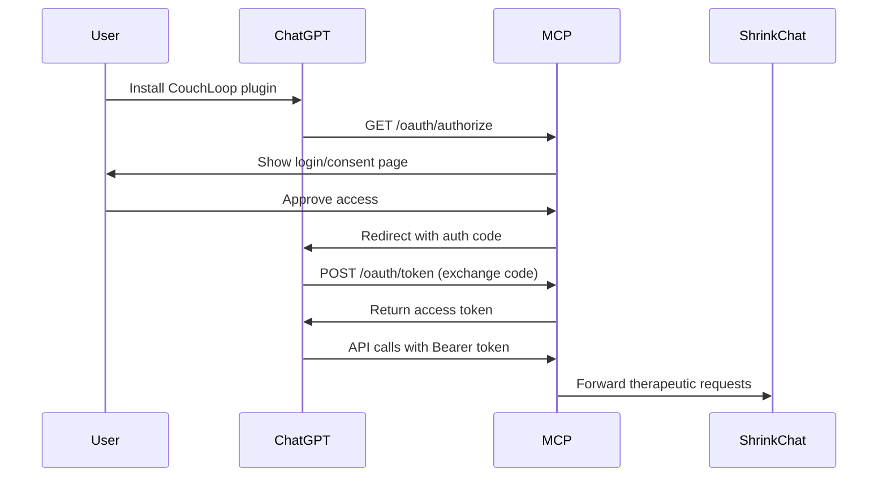

# OAuth Implementation Plan for MCP

> **Created**: January 8, 2026
> **Purpose**: Implement OAuth 2.0 for secure MCP authentication with ChatGPT and other clients

## Current Status

### ✅ Completed
- Database schema ready (sessions, users tables)
- OAuth configuration in `.env.local`
- JWT secret configured
- Shrink-chat integration working

### ❌ Missing OAuth Components
- OAuth authorization server
- Token generation and validation
- User authentication flow
- Session management with OAuth
- Client credential verification

## OAuth Flow Required

### For ChatGPT Plugin (Consumer App)


## Implementation Components

### 1. OAuth Authorization Server

```typescript
// src/server/oauth/authServer.ts
import express from 'express';
import { v4 as uuidv4 } from 'uuid';
import jwt from 'jsonwebtoken';

export class OAuthServer {
  private authCodes = new Map<string, AuthCode>();
  private accessTokens = new Map<string, AccessToken>();

  // GET /oauth/authorize
  async authorize(req: Request): Promise<Response> {
    const { client_id, redirect_uri, state, scope } = req.query;

    // Verify client_id
    if (client_id !== process.env.OAUTH_CLIENT_ID) {
      return new Response('Invalid client', { status: 400 });
    }

    // Generate auth code
    const code = uuidv4();
    this.authCodes.set(code, {
      clientId: client_id,
      redirectUri: redirect_uri,
      scope,
      expiresAt: Date.now() + 600000, // 10 minutes
    });

    // Redirect back with code
    const redirectUrl = `${redirect_uri}?code=${code}&state=${state}`;
    return Response.redirect(redirectUrl);
  }

  // POST /oauth/token
  async token(req: Request): Promise<Response> {
    const { grant_type, code, client_id, client_secret } = await req.json();

    // Verify client credentials
    if (client_id !== process.env.OAUTH_CLIENT_ID ||
        client_secret !== process.env.OAUTH_CLIENT_SECRET) {
      return new Response('Invalid client credentials', { status: 401 });
    }

    if (grant_type === 'authorization_code') {
      // Verify auth code
      const authCode = this.authCodes.get(code);
      if (!authCode || authCode.expiresAt < Date.now()) {
        return new Response('Invalid or expired code', { status: 400 });
      }

      // Generate access token
      const accessToken = jwt.sign(
        {
          sub: uuidv4(), // user id
          client_id,
          scope: authCode.scope
        },
        process.env.JWT_SECRET!,
        { expiresIn: '24h' }
      );

      // Store token
      this.accessTokens.set(accessToken, {
        userId: uuidv4(),
        clientId: client_id,
        scope: authCode.scope,
        expiresAt: Date.now() + 86400000, // 24 hours
      });

      // Clean up used auth code
      this.authCodes.delete(code);

      return Response.json({
        access_token: accessToken,
        token_type: 'Bearer',
        expires_in: 86400,
        scope: authCode.scope,
      });
    }

    return new Response('Unsupported grant type', { status: 400 });
  }
}
```

### 2. Token Validation Middleware

```typescript
// src/middleware/auth.ts
import jwt from 'jsonwebtoken';

export async function validateToken(req: Request): Promise<boolean> {
  const authHeader = req.headers.get('Authorization');

  if (!authHeader?.startsWith('Bearer ')) {
    return false;
  }

  const token = authHeader.substring(7);

  try {
    const decoded = jwt.verify(token, process.env.JWT_SECRET!);
    // Attach user context to request
    (req as any).user = decoded;
    return true;
  } catch {
    return false;
  }
}

export function requireAuth(handler: Function) {
  return async (req: Request, ...args: any[]) => {
    if (!await validateToken(req)) {
      return new Response('Unauthorized', { status: 401 });
    }
    return handler(req, ...args);
  };
}
```

### 3. Database Schema Updates

```sql
-- OAuth tokens table
CREATE TABLE oauth_tokens (
  id UUID PRIMARY KEY DEFAULT gen_random_uuid(),
  user_id UUID REFERENCES users(id),
  client_id VARCHAR(255) NOT NULL,
  access_token TEXT NOT NULL,
  refresh_token TEXT,
  scope TEXT,
  expires_at TIMESTAMP NOT NULL,
  created_at TIMESTAMP DEFAULT NOW(),
  INDEX idx_access_token (access_token),
  INDEX idx_user_client (user_id, client_id)
);

-- OAuth clients table (for multiple clients in future)
CREATE TABLE oauth_clients (
  client_id VARCHAR(255) PRIMARY KEY,
  client_secret VARCHAR(255) NOT NULL,
  redirect_uris TEXT[], -- Array of allowed redirect URIs
  grant_types TEXT[],
  scopes TEXT[],
  created_at TIMESTAMP DEFAULT NOW()
);
```

### 4. MCP Server Integration

```typescript
// src/server/index.ts
import { OAuthServer } from './oauth/authServer';
import { requireAuth } from './middleware/auth';

const oauthServer = new OAuthServer();

// Public OAuth endpoints
app.get('/oauth/authorize', (req) => oauthServer.authorize(req));
app.post('/oauth/token', (req) => oauthServer.token(req));

// Protected MCP endpoints
app.post('/api/mcp/send-message', requireAuth(sendMessage));
app.post('/api/mcp/create-session', requireAuth(createSession));
```

### 5. Plugin Manifest for ChatGPT

```json
// .well-known/ai-plugin.json
{
  "schema_version": "v1",
  "name_for_human": "CouchLoop",
  "name_for_model": "couchloop",
  "description_for_human": "AI-powered therapeutic support and mental wellness companion",
  "description_for_model": "Therapeutic AI assistant for mental health support, crisis detection, and emotional wellness tracking",
  "auth": {
    "type": "oauth",
    "client_url": "https://couchloop-mcp.com/oauth/authorize",
    "scope": "read write",
    "authorization_url": "https://couchloop-mcp.com/oauth/authorize",
    "authorization_content_type": "application/x-www-form-urlencoded",
    "verification_tokens": {
      "openai": "YOUR_VERIFICATION_TOKEN"
    }
  },
  "api": {
    "type": "openapi",
    "url": "https://couchloop-mcp.com/openapi.yaml"
  },
  "logo_url": "https://couchloop-mcp.com/logo.png",
  "contact_email": "support@couchloop.com",
  "legal_info_url": "https://couchloop.com/legal"
}
```

## Security Considerations

### 1. Token Security
- Use secure random generation for codes
- Implement token expiration and refresh
- Store tokens hashed in database
- Use HTTPS only in production

### 2. Client Verification
- Validate redirect URIs against whitelist
- Implement PKCE for public clients
- Rate limit token endpoints

### 3. Scope Management
```typescript
enum OAuthScope {
  READ = 'read',           // View sessions and messages
  WRITE = 'write',         // Send messages
  CRISIS = 'crisis',       // Access crisis detection
  MEMORY = 'memory',       // Access memory features
  ADMIN = 'admin'          // Administrative access
}
```

### 4. Session Security
- Link OAuth tokens to MCP sessions
- Implement token revocation
- Track token usage for auditing

## Testing Strategy

### 1. Unit Tests
```typescript
// tests/oauth.test.ts
describe('OAuth Server', () => {
  test('should generate valid auth code');
  test('should exchange code for token');
  test('should reject invalid client');
  test('should validate token expiry');
});
```

### 2. Integration Tests
- Test full OAuth flow with ChatGPT
- Verify token validation in API calls
- Test error scenarios

### 3. Security Tests
- Attempt token replay attacks
- Test redirect URI validation
- Verify scope enforcement

## Implementation Priority

1. **Phase 1: Basic OAuth** (Required for ChatGPT)
   - Authorization endpoint
   - Token endpoint
   - JWT validation
   - Basic session linkage

2. **Phase 2: Security Hardening**
   - PKCE support
   - Refresh tokens
   - Token revocation
   - Rate limiting

3. **Phase 3: Advanced Features**
   - Multiple client support
   - Scope-based permissions
   - Admin dashboard
   - Usage analytics

## Environment Variables Required

```bash
# OAuth Configuration
OAUTH_CLIENT_ID=couchloop_chatgpt
OAUTH_CLIENT_SECRET=<generate-secure-secret>
OAUTH_REDIRECT_URI=https://chat.openai.com/aip/plugin/oauth/callback

# JWT Configuration
JWT_SECRET=<generate-secure-secret>
JWT_EXPIRES_IN=24h

# Security
ALLOWED_ORIGINS=https://chat.openai.com
SECURE_COOKIES=true
SESSION_SECRET=<generate-secure-secret>
```

## Next Steps

1. Generate secure secrets for production
2. Implement OAuth authorization server
3. Add token validation middleware
4. Create plugin manifest
5. Test with ChatGPT sandbox
6. Deploy to production with HTTPS
7. Submit plugin for OpenAI review

## Resources

- [OAuth 2.0 RFC](https://datatracker.ietf.org/doc/html/rfc6749)
- [ChatGPT Plugin Auth](https://platform.openai.com/docs/plugins/authentication)
- [JWT Best Practices](https://datatracker.ietf.org/doc/html/rfc8725)
- [PKCE RFC](https://datatracker.ietf.org/doc/html/rfc7636)